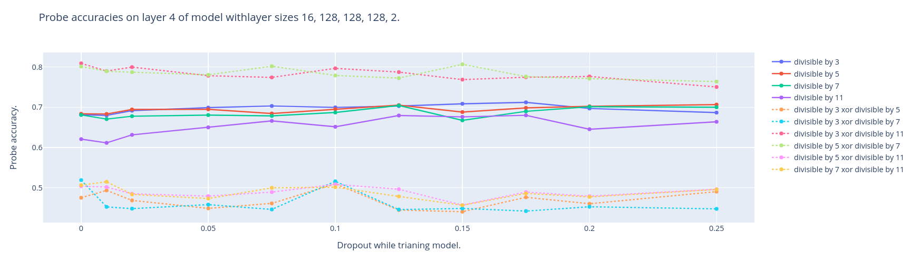

It was noticed [here](https://www.lesswrong.com/posts/hjJXCn9GsskysDceS/what-s-up-with-llms-representing-xors-of-arbitrary-features) that if a model linearly represents two features, then it represents the xor of those features, even if the features are seemingly totally unrelated.

Here, "linearly represents" a feature means that we can train a linear probe on the activations of a model that correlates with the feature, i.e. there is a direction in the activations space that is correlated with the feature.
Unlike in some other contexts, we do not require that this direction be used by the model for later computation.

We make the hypothesis that this is some form of error correction.
To test this hypothesis, we test if xors of features are represented better in models trained with dropout than in models trained without dropout, because the former would have to do more error correction.
(Note, however, that it was observed that even models trained without dropout have redundency, so one would expect to still find mechanisms responsible for error correction in them.)
Note that those experiments are not totally sufficient to support the hypothesis because it could be that models with dropout just have more random things so it is more likely that some of them is randomly correlated with the xor.

We do two experiments, one on Pythia-160m - which suggest that xors are indeed better represented in models with dropout - and one on a small toy model - which is inconclusive.

# Experiments

## Factual Associations on Pythia-160m

Pythia-160m has been trained with and without dropout.
More precisely, four models pythia-160m-alldropout, pythia-160m-attn-dropout, pythia-160m-hidden-dropout, and pythia-160m (which we call pythia-160m-no-dropout) exist which have been respectively trained with dropout on both attention and MLP, only on attention, only on MLP, and no dropout.

We study three datasets with sentences of the form "Person: something [is / is not] something_else." where Person is either Alice or Bob.
We search probes for the labels `alice` - the person speaking is Alice, `not` - the sentence contains not, and `correct` - the sentence is a true statement, as well as the xors of those labels.

We consistently observe a greater accuracy for probing the label `not_xor_correct` than the label `correct`.
We argue that this is a reasonable finding and that it means the label `not_xor_correct` should be seen as a primitive label and the label `correct` should be seen as the xor of the labels `not_xor_correct` and `not`.
An explanation one could imagine for this is that the model has a direction which represents whether the subject and object of the sentence are related (this is the `not_xor_correct` direction), and whether the sentence is correct is computed later as the xor of this direction with the direction of whether the `not` direction`

### Cities Dataset for Geometry of Truth

Dataset from the geometry of truth [paper](https://arxiv.org/abs/2310.06824). [repo](https://github.com/saprmarks/geometry-of-truth).
Example sentences: "Alice: The city of Cuiaba is in Brazil.", "Bob: The city of Cuiaba is not in Latvia.".

### Larger Than Dataset from Geometry of Truth

Dataset from the geometry of truth [paper](https://arxiv.org/abs/2310.06824). [repo](https://github.com/saprmarks/geometry-of-truth).
Example sentences: "Alice: Sixty-nine is larger than sixty-five.", "Bob: Eighty-four is smaller than sixty-two.".
Note that in this dataset, the `not` label is true if the sentence contains the word "smaller", not the word "not".

![image(plot_larger_than.png)

### Technical Details

The probe is trained on the activations of the last token of the sentence, which is always ".".

We prepend the beginning of sequence token to the sentences when collecting the activations.
A person who tried to reproduce our work didn't prepend it and got significantly different results (~~and it took us a couple hours to figure out why we were getting differen tresults~~).

### Things Dataset

This is a (somewhat dirty) dataset we synthesized.
Example sentences: "Alice: Pine trees are cone-bearing trees.", "Bob: Cupcakes are not earthquakes."

## Toy Model on Toy Arithmetic Task

We train a small fully connected neural network which takes as input the bits of a 16 bit number and outputs two booleans - whether this number is divisible by 33 and whether it is divisible by 35.
We train it with different model sizes and different dropouts.

We probe whether the number is divisible by 3, 5, 7, and 11, as well as the xors of those probes (Becuase we have decompositions into prime factors `33 = 3 * 11` and `35 = 5 * 7`).

